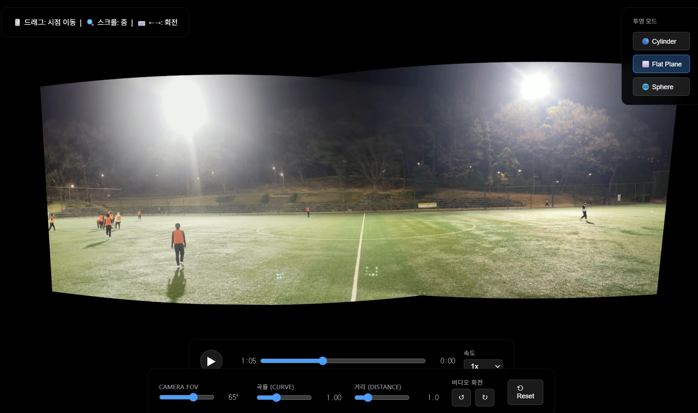

# Panorama Video Stitching Pipeline

축구장 좌/우 카메라 영상을 파노라마 영상으로 스티칭하는 E2E 파이프라인입니다.



## 설치

```bash
pip install opencv-python numpy tqdm torch torchvision
pip install kornia  # DISK + LightGlue 매칭용
```

FFmpeg (비디오 인코딩용):
```bash
# Ubuntu/Debian
sudo apt install ffmpeg

# macOS
brew install ffmpeg

# Windows
# https://ffmpeg.org/download.html 에서 다운로드
```

## 사용법

### E2E 파이프라인 (권장)

```bash
# pair 번호만 지정하면 모든 경로 자동 생성
python pipeline.py 1
```

`asset/1/` 폴더에서 `left.MOV`, `right.MOV`, `focal.json`을 자동으로 읽고,
��과를 `frames_sync/1/`, `calibrations/1/`, `output/1_spec/`에 저장합니다.

### 옵션

```bash
python pipeline.py 1 \
    --method cylindrical \        # 스티칭 방식 (cylindrical / planar)
    --fps 30 \                    # FPS override (기본: 자동 감지)
    --workers 4 \                 # 병렬 처리 워커 수
    --max-frames 1000             # 최대 추출 프레임 수 (기본: 전체)
```

### 단계 건너뛰기

```bash
python pipeline.py 1 --skip-sync       # 이미 싱크된 프레임이 있을 때
python pipeline.py 1 --skip-calib      # 이미 캘리브레이션이 있을 때
python pipeline.py 1 --skip-stitch     # 스티칭 건너뛰기
```

### focal.json 없이 ��접 지정

```bash
python pipeline.py 1 --left-focal 24 --right-focal 26
```

### 개별 스크립트 실행

```bash
# 자동 캘리브레이션
python auto_calibrate.py \
    --left ./frames_sync/1/left/frame_000001.jpg \
    --right ./frames_sync/1/right/frame_000001.jpg \
    --output ./calibrations/1/calib_spec.json \
    --left-focal 13 --right-focal 13

# 스티칭
python stitch_video.py \
    --left ./frames_sync/1/left \
    --right ./frames_sync/1/right \
    --calib ./calibrations/1/calib_spec.json \
    --output ./output/1_spec

# 비디오만 생성
python stitch_video.py --video-only --frames ./output/1_spec/frames --fps 30
```

## 폴더 구조

```
project/
├── asset/                          # 소스 영상 + 카메라 설정
│   ├── 0/
│   │   ├── left.MOV                # 좌측 카메라 영상
│   │   ├── right.MOV               # 우측 카메라 영상
│   │   └── focal.json              # 카메라 focal length 설정
│   ├── 1/ ...
│
├── calibrations/                   # 캘리브레이션 결과
│   ├── 0/
│   │   ├── calib_spec.json         # 대응점 + 호모그래피
│   │   └── spec_matches_vis.jpg    # 매칭 시각화
│   ├── 1/ ...
│
├── frames_sync/                    # 동기화된 프레임 (자동 생성)
│   ├── 0/
│   │   ├── left/
│   │   └── right/
│   ├── 1/ ...
│
├── output/                         # 스티칭 출력 (자동 생성)
│   ├── 0_spec/
│   │   ├── frames/
│   │   ├── sync_verify/
│   │   ├── panorama.mp4
│   │   └── panorama.web.mp4
│   ├── 1_spec/ ...
│
├── pipeline.py                     # E2E 파이프라인
├── audio_sync.py                   # 오디오 싱크
├── auto_calibrate.py               # 자동 캘리브레이션 (DISK + LightGlue)
├── stitch_video.py                 # 파노라마 스티칭
└── video_viewer.html               # 3D 파노라마 뷰어
```

### focal.json 형식

```json
{
  "left_focal_mm": 24,
  "right_focal_mm": 26
}
```

`null`로 설정하면 focal length 없이 auto 모��로 실행됩니다.

## 비디오 뷰어

`video_viewer.html` 파일을 브라우저에서 열어 파노라마 비디오를 3D로 감상할 수 있습니다.

- 드래그로 시점 회전
- 스크롤로 줌 인/아웃
- 3가지 투영 모드 (Cylinder, Flat Plane, Sphere)
- 곡률/거리 조절, 재생 속도 조절

## 스티칭 방식 비교

| 방식 | 장점 | 단점 |
|------|------|------|
| **cylindrical** | 외곽 왜곡 감소, 자연스러운 비율 | 시야각 좁음 |
| **planar** | 넓은 시야각, 빠른 처리 | 외곽 물체 확대 |

## 문제 해결

### 메모리 부족
- `--workers 1`로 단일 스레드 처리

### 비디오 재생 안됨
```bash
ffmpeg -i panorama.mp4 -c:v libx264 -crf 23 -pix_fmt yuv420p panorama_web.mp4
```

## 라이선스

MIT License
